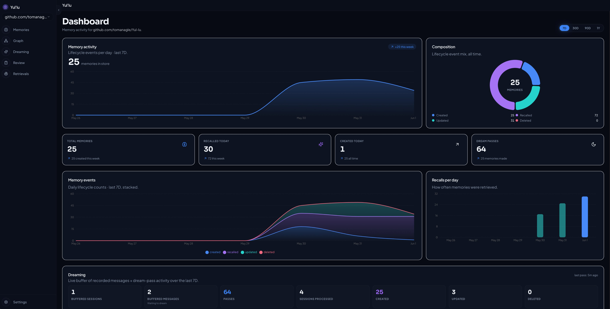

# Yul'lu

Persistent, semantically-searchable memory for LLMs - scoped per codebase,
syncable across a team via a `.yullu/` directory committed to the repo.




> **Distribution status:** Yul'lu is pre-release. The only supported way
> to install right now is to clone this repo and build from source. No
> Homebrew tap, npm package, or pre-built binaries yet. The CLI subcommand
> `yullu install` (described below) wires Yul'lu into your AI assistant
> *after* you've built the binary - it isn't itself the installer.

## Install

**Requirements:**
- **Go 1.25+** and a working **cgo** toolchain (Xcode CLT on macOS).
- **Bun** for the frontend (`brew install oven-sh/bun/bun`, see <https://bun.sh>).
- An **embeddings API key** — **Voyage** (default, code-aware, free tier at
  <https://voyageai.com>) or **OpenAI**. Paste it into the Settings page on
  first launch.
- Reasoning (for dreaming) needs **no key by default** — it uses MCP sampling
  through your AI client. Set a direct **Anthropic** or **OpenAI** key only if
  you want background dreaming on a timer (see Reasoning below). Note:
  embeddings can't use Anthropic — it has no embeddings API.

```bash
git clone https://github.com/tomanagle/Yullu.git
cd Yullu
make install        # builds frontend + Go binary, installs `yullu` to $GOPATH/bin
yullu install       # wires Yul'lu into your AI assistant (skill + MCP + Stop hook)
yullu               # starts the server at http://localhost:47823
```

`make install` does two things in one step: builds the React frontend
(`bun run build`) and embeds it into the Go binary, then compiles and
copies that binary to `$GOPATH/bin/yullu`.

Once it's on your `PATH`, `yullu install` handles the rest of the setup
per-assistant (see below).

## Setting up your AI assistant

After `make install`, run:

```bash
yullu install              # auto-detects Claude Code + Codex CLI, wires both
yullu install cursor       # opt-in; ~/.cursor is shared with the VS Code IDE so it's explicit
yullu install --service    # also install a launchd/systemd auto-start unit
yullu install --yes        # answer yes to any prompts (good for scripted setups)
```

What this writes:

| Assistant | What `yullu install` does |
|---|---|
| **Claude Code** | Writes `~/.claude/skills/yullu/SKILL.md`, runs `claude mcp add yullu`, adds a **Stop hook** to `~/.claude/settings.json` so `record_messages` fires deterministically after every turn. |
| **Codex CLI** | Writes a yullu section to `~/.codex/AGENTS.md`, adds `[mcp_servers.yullu]` to `~/.codex/config.toml`. (No hook support in Codex - recording depends on the model honouring the rules.) |
| **Cursor** | Adds `mcpServers.yullu` to `~/.cursor/mcp.json` (preserves other servers). Cursor rules are per-project; the install prints a snippet for you to commit to `.cursor/rules/yullu.mdc`. |

Reasoning happens via **MCP sampling** by default - your client (Claude
Code, Codex) does the LLM call using its own credentials, so Pro/Plus
subscriptions cover dreaming without a separate API key.

`yullu uninstall` reverses everything (Stop hook removed, MCP entries
deregistered, service unit unloaded).

## Day-to-day

```bash
yullu               # run the server (or use the service unit installed above)
make dev            # HMR dev loop: vite on :47824 + air-rebuilt Go server on :47823
make smoke          # round-trips initialize + tools/list over stdio
make test           # runs the Go test suite
```

## What it does

When an LLM learns something durable about a codebase - a decision, a
gotcha, a one-off fact, the reason behind a design - it calls
`store_memory`. Future sessions in the same repo call `retrieve_memories`
to pull the relevant ones back. Memories are:

- **Scoped automatically** by the repo's `origin` remote URL (canonicalised
  so SSH and HTTPS clones resolve to the same project), or the git-root
  path / CWD as fallbacks.
- **Indexed by embedding vector** in SQLite via `sqlite-vec`, so retrieval
  is semantic, not keyword.
- **Optionally synced across teammates** via an event log committed to the
  repo at `<repo>/.yullu/logs/`.
- **Optionally dreamed** - the server can review recorded conversation
  turns and extract durable memories without the LLM having to call
  `store_memory` explicitly.
- **Optionally filtered** by a similarity threshold so weak matches are
  dropped instead of injected as noise, and **rated for relevance** per
  recall via the Retrievals page (see [Retrieval relevance](#retrieval-relevance)).

## Reasoning via MCP sampling

Yul'lu uses **MCP sampling** for reasoning by default: when the
server needs an LLM (for dreaming, for example), it asks the *client*
(Claude Code, Codex, etc.) to make the call. The client handles the
credentials and billing - so users with **Claude Pro** or **ChatGPT Plus**
pay through their existing subscription with no extra setup.

Set `[reasoning].provider = "anthropic"` or `"openai"` with an API key
to also enable **background dreaming** - scheduled passes don't have an
active client session to sample from, so they need a direct provider.
Without a direct provider, background dreaming is a no-op; foreground
`dream_now` still works fine via sampling.

## Configuration

A `config.toml` is read from the current directory on every server start
(one per project). Defaults are written on first run. Override the location
with `$YULLU_CONFIG`.

```toml
[embedding]
# provider: "voyage" | "openai". voyage-code-3 is the default - code-aware,
# generous free tier. Get a key at https://voyageai.com.
provider = "voyage"
model = ""       # blank uses provider default

[reasoning]
# Blank = use MCP sampling (client handles the LLM call using its credentials).
# "anthropic" or "openai" with an API key also enables background dreaming.
provider = ""
model = ""

[openai]
api_key = ""     # blank reads $OPENAI_API_KEY

[anthropic]
api_key = ""     # blank reads $ANTHROPIC_API_KEY

[voyage]
api_key = ""     # blank reads $VOYAGE_API_KEY

[sync]
enabled = true                    # write/read .yullu/logs
dir = ".yullu"
log_embeddings = true             # publish your computed vectors
reuse_embeddings = true           # accept teammates' vectors when model matches
auto_reconcile_on_startup = true  # apply teammates' events on boot

[dreaming]
enabled = true                    # background memory extraction from chats
interval = "30m"                  # scheduled dream cadence
min_messages = 10                 # scheduler skips sessions smaller than this
context_memories = 50             # how many memories the reasoner sees per pass
on_idle_seconds = 0               # also dream after N idle seconds (0 = off)

[retrieval]
# Cosine-similarity floor (0.0-1.0) a memory must clear to be returned by a
# vector search. Defaults to 0.6 (60%) so an unrelated query pulls nothing
# instead of padding the result with noise. Set to 0 to disable the floor
# (always return the top matches). Tune in the UI via Settings → Retrieval.
min_similarity = 0.6
```

### Environment variables

| variable | what it overrides |
|---|---|
| `YULLU_CONFIG` | path to `config.toml` |
| `YULLU_DB` | path to the SQLite database |
| `YULLU_LOG_LEVEL` | `debug` / `info` / `warn` / `error` (default `info`) |
| `YULLU_EMBED_PROVIDER` / `_MODEL` | embedding provider/model |
| `YULLU_REASON_PROVIDER` / `_MODEL` | reasoning provider/model |
| `OPENAI_API_KEY` / `ANTHROPIC_API_KEY` / `VOYAGE_API_KEY` | API keys |

The desktop server always listens on `:47823`. For clients that can't
speak HTTP MCP, `yullu stdio` runs the MCP endpoint over stdio instead
(legacy - prefer the HTTP endpoint exposed by the desktop server).

### Storage paths

- **Database**: `$YULLU_DB`, else `$XDG_DATA_HOME/yullu/memories.db`,
  else `~/.local/share/yullu/memories.db`. One DB per user, shared
  across every repo you use the binary in - rows are scoped by `project_id`.
- **Event log**: `<repo>/.yullu/logs/`, one JSON file per event. This
  is what teammates see; the database is per-machine.

## MCP tools

| tool | purpose |
|---|---|
| `store_memory` | Save a memory. Embeds + scopes to project. Returns the local `id` and the cross-machine `uuid`. |
| `retrieve_memories` | Semantic search over the current project's memories. Each hit carries a `similarity` (0-1 cosine match) and 1-based `rank`; hits below `[retrieval].min_similarity` are dropped. |
| `update_memory` | Patch content and/or tags by local `id`. Re-embeds if content changed. |
| `delete_memory` | Delete by local `id`. |
| `list_memories` | Recently updated memories for the current project. Useful as an overview. |
| `reconcile_memories` | Pull events from `.yullu/` and publish any local-only rows. Safe to run repeatedly. |
| `record_messages` | Push conversation turns into the dream buffer so the server can later extract memories from them. |
| `dream_now` | Trigger an immediate dream pass over recorded session messages. |
| `get_usage` | Aggregate model usage (calls, tokens, cost, latency in USD microcents) by provider+model+kind. |

## Team sync via `.yullu/`

When `[sync].enabled = true`, the server treats `<repo>/.yullu/logs/`
as an append-only log of memory mutations.

**What's in it.** One JSON file per event. Filenames are time-sortable with
nanosecond precision. Event types:

- `create` - content + tags for a new memory (`memory_id` is a UUID).
- `update` - partial patch (omit `content` or `tags` to leave unchanged).
- `delete` - tombstones the memory.
- `embedding` - an embedding vector tagged with the model that produced it,
  so teammates on the same model can skip re-embedding.

**Multi-developer flow.**

1. Alice calls `store_memory`. The server writes a `create` event, embeds
   locally, inserts into her DB, and (if `log_embeddings`) writes an
   `embedding` event tagged with her embedder ID.
2. Alice commits and pushes the `.yullu/` changes.
3. Bob pulls. On next server start (auto-reconcile) or via
   `reconcile_memories`, his server reads Alice's events. Same embedder ID:
   Bob's DB picks up Alice's vector - zero embed calls. Different embedder:
   Bob embeds locally and writes a new `embedding` event for his model, so
   the next teammate using that model gets the free ride.

**Reconcile is idempotent.** Per-project watermarks in the DB (`meta` table
key `last_event:<project_id>`) track which event filenames have been
processed. Re-running reconcile does nothing if no new events have arrived.

**Privacy.** Events are committed to the repo. If the repo is public, the
memories are public. Treat `.yullu/` like documentation - review the
diff before pushing.

## Dreaming

Most memories don't get explicitly flagged by the user - they emerge from
the conversation itself ("oh by the way, we use Bun here", "that migration
was reverted because of X"). **Dreaming** is the background process that
extracts those memories without the LLM (or the human) having to call
`store_memory` explicitly.

**The loop:**

1. The LLM calls `record_messages` after each turn (or in batches), pushing
   `{session_id, [{role, content}, …]}` into a local `session_messages`
   table. The raw text never leaves the local DB - it's not written to
   `.yullu/logs/`.
2. On a schedule (or on demand via `dream_now`), the server pulls
   unprocessed messages for each session plus the most recently updated
   memories for the project, and asks the **reasoner** to return a JSON
   list of operations:

   ```json
   {
     "operations": [
       {"op": "create", "content": "…", "tags": ["…"], "reasoning": "…"},
       {"op": "update", "uuid": "<existing>", "content": "…", "reasoning": "…"},
       {"op": "delete", "uuid": "<existing>", "reasoning": "…"}
     ]
   }
   ```

3. Each op is applied via the same write path as a direct LLM call - so
   dreamed memories show up in `.yullu/logs/` and propagate to
   teammates exactly like memories created by `store_memory`.
4. Processed messages are deleted from the local DB. Memories live; the
   conversation that produced them does not.

**When dreaming fires:**

- **Interval**: every `[dreaming].interval` (default `30m`). The first
  pass runs on the first tick after server start, so messages pushed
  before boot get processed promptly.
- **Idle** (optional): if `[dreaming].on_idle_seconds > 0`, also fires
  when `record_messages` has been silent for that many seconds and there
  are unprocessed messages. Off by default.
- **Manual**: `dream_now` MCP tool. Bypasses the `min_messages` floor.

**Failure handling:**

- Reasoner network error → session is reported in the result's `errors`,
  messages remain in the buffer for the next pass.
- Reasoner returns prose with no JSON, or malformed JSON → same outcome.
  We log the response excerpt and keep the messages.
- An individual op fails to apply (e.g. `update` for a UUID that doesn't
  exist locally) → that op is counted as skipped, the rest still apply.
  Messages are deleted after the apply pass regardless.

**Single-flight.** Concurrent dreams (a scheduled tick during a slow
`dream_now`) are serialised; the late caller returns `{skipped: true}`
immediately rather than queuing.

**Tuning knobs in `[dreaming]`:**

| key | default | what it does |
|---|---|---|
| `enabled` | `true` | Turn the scheduler on/off. `record_messages` and `dream_now` work regardless. |
| `interval` | `"30m"` | Go duration between scheduled dreams. |
| `min_messages` | `10` | Scheduler skips sessions with fewer messages. `dream_now` ignores this. |
| `context_memories` | `50` | How many existing memories the reasoner sees per pass. Bigger = better update/delete decisions, more tokens. |
| `on_idle_seconds` | `0` | If > 0, also dream after this many seconds of `record_messages` silence. |

## Retrieval relevance

Vector search returns the top matches by embedding similarity. Two pieces
of machinery keep those matches honest:

**Similarity floor.** Each hit carries a `similarity` score (0-1 cosine
match) and a 1-based `rank`. `[retrieval].min_similarity` is a floor: a
memory must clear it to be returned, so a query with no strong match
returns fewer - or zero - memories instead of padding the result with
weak ones. Stored and query vectors are unit-normalized, which is what
makes the raw `sqlite-vec` L2 distance translate into a meaningful cosine
percentage. Defaults to `0.6` (60%); set it to `0` to disable, or tune it
globally or per-project under **Settings → Retrieval** (the per-project value
lives in the team-shared `.yullu/config.toml`, so a noisy monorepo can carry a
stricter floor than a focused one).

**Relevance feedback.** Every recall is logged locally (the query, the
matched memory, its similarity, and its rank). The **Retrievals** page in
the UI surfaces that history and lets you mark each one a *good* or *bad*
match. This rates the *retrieval* ("was returning this memory for this
query a good match?"), which is distinct from the 1-10 *quality* rating on
the Review page ("is this memory worth keeping at all?") - the same memory
can be a great match for one query and noise for another. Verdicts are
keyed to the recall event, stay on your machine (never synced to
`.yullu/`), and feed threshold tuning.

## Makefile

Run `make help` to see the list.

| target | what it does |
|---|---|
| `start` | Build the frontend, build + install `yullu`, launch the desktop server at `:47823` and open it in the browser. |
| `dev` | HMR dev loop: Vite on `:47824` (proxies `/api` and `/mcp` to the Go server on `:47823`) + `air` rebuilds the Go binary on change. Open <http://localhost:47824> during dev. |
| `build` | Build the frontend and compile the `yullu` binary (frontend embedded) to `./bin/yullu`. |
| `install` | Build the frontend + install `yullu` to `$GOPATH/bin`. |
| `refresh` | Rebuild the Go binary + re-point the Stop hook at it, without rebuilding the frontend (embeds the current `frontend/dist`). |
| `run` | Build + install, then run the server. |
| `register` | Print the `claude mcp add yullu …` command for the desktop server. |
| `smoke` | End-to-end stdio round-trip: initialize + tools/list (no API key needed). |
| `test` | Run the Go test suite (`go test -tags sqlite_fts5 ./...`). |
| `tidy` | `go mod tidy` |
| `fmt` | `gofmt -s -w .` |
| `vet` | `go vet ./...` |
| `clean` | Remove `./bin` and `frontend/dist`. |

## How it works

The layout is flat - there's no `cmd/` directory. The single `yullu`
binary is both the desktop server and the CLI; subcommands and the
`net/http` mux live at the repo root, business logic under `internal/`.

```
.
├─ main.go               entry point: CLI subcommands (install, inject,
│                        record-turn, …) + the desktop server's net/http
│                        mux - / (embedded frontend), /api/*, /mcp on :47823
├─ app.go                App struct - state machine; methods shared by the
│                        REST API and MCP, operating on one *server.Server
├─ stdio.go              standalone stdio/HTTP MCP transport (no UI)
├─ inject.go             UserPromptSubmit recall hook (yullu inject)
├─ record_turn.go        Stop-hook entry that POSTs turns to record_messages
├─ install.go service.go install/uninstall + launchd/systemd service unit
├─ frontend/             React + TanStack + shadcn, built to frontend/dist
│                        and embedded via //go:embed
└─ internal/
   ├─ applog             structured logger configuration (slog + JSON)
   ├─ config             loads config.toml + per-project overrides + env
   ├─ ai                 Embedder / Reasoner interfaces + providers
   │                     (voyage, openai embedding; anthropic, openai reasoning)
   │                     + per-call usage tracking → SQLite usage table
   ├─ store              SQLite + sqlite-vec: schema/migration, CRUD, the
   │                     session_messages dream buffer, recall analytics
   ├─ scope              resolves project_id from git remote / path
   ├─ memlog             event log writer + reader for .yullu/logs/
   ├─ handlers           JSON REST handlers (one file per endpoint) + the
   │                     small dependency interfaces each is built from
   └─ server             MCP tool handlers, reconcile + dream algorithms.
                         Server.callReasoner tries MCP sampling first, then
                         falls back to the configured direct Reasoner.
```

Process-critical startup uses the Must pattern: config load, embedder
construction, reasoner construction, and store open all panic on failure
so the service can't come up half-broken.

**Database schema** (one DB per user, scoped by `project_id`):

- `memories(id, uuid, project_id, content, tags_json, created_at, updated_at,
  category, rating, rating_comment)`
  - `id` is local autoincrement; `uuid` is the cross-machine identifier.
  - `category` is the content-shape axis (process/decision/gotcha/domain/style);
    `rating` (1-10) + `rating_comment` come from the Review queue.
- `memory_vectors` - sqlite-vec `vec0` virtual table, dimension-bound at
  creation. Vectors are stored unit-normalized so L2 distance maps to cosine
  similarity. Switching to an embedder with a different dim or ID is refused
  at startup; delete the DB to change embedders.
- `memories_fts` - FTS5 virtual table over content + tags (free local
  keyword search, the fallback when there's no embedder).
- `rejected_memories` - memories rated ≤ 5, archived as anti-examples the
  next dream pass sees.
- `session_messages` - the local dream buffer: raw conversation turns
  awaiting extraction. Never written to `.yullu/logs/`.
- `memory_events` - local observability log (created/updated/deleted/recalled),
  scoped per project. Recall events carry the query, distance, similarity,
  and rank. Never synced.
- `retrieval_ratings` - per-recall relevance verdicts (+1/-1), keyed to a
  `memory_events` recall row. Local-only.
- `dream_passes` - one row per non-skipped dream run (counts the reasoner
  produced), for the Stats dashboard.
- `project_locations` - registry mapping each `project_id` to its on-disk
  git root, so per-project paths resolve correctly across repos.
- `usage` - per-call event log: provider, model, tokens, cost, latency.
- `meta` - key/value: `embed_id`, `embed_dim`, per-project watermarks.

**Reconcile** is a two-pass algorithm:

1. Stream every event file. Track `knownCreates` (every UUID that has ever
   had a `create` event) and, for events newer than the watermark, a
   per-UUID target state.
2. Apply per-UUID state to the local DB. Reuse a logged embedding when
   `reuse_embeddings` is on and the model + dim match and the embedding
   event's filename is newer than the latest content-changing event for
   that UUID. Otherwise embed locally and (if `log_embeddings`) publish a
   new embedding event for our model.

After applying events, any local row whose UUID isn't in `knownCreates`
gets a `create` event (and, if logging is on, an `embedding` event with
the existing local vector) so teammates pick it up.

## Desktop server (Go + React)

The desktop "app" is a single Go binary (`yullu`) that serves a
React UI, a REST API, and the MCP endpoint on the same port - the browser
is the UI, there's no native window. Same SQLite DB, same `config.toml`,
and the same `*server.Server` instance powers the UI and MCP, so anything
you do in the browser is visible to the LLM and vice versa.

**Stack:**
- **Go `net/http`** with a single `ServeMux` (built in the root `main.go`):
  `/` (embedded SPA), `/api/*` (REST handlers in `internal/handlers/`, one
  file per endpoint), `/mcp` (`mark3labs/mcp-go`'s Streamable HTTP handler,
  hot-swappable when `SaveConfig` rebuilds the Server).
- **React** + **TypeScript** + **Vite** - frontend, built into
  `frontend/dist/` and embedded via `//go:embed`.
- **TanStack Router** - code-based routes (`/` stats, `/memories`, `/graph`,
  `/dreaming`, `/review`, `/retrievals`, `/settings`).
- **TanStack Query** - thin fetch wrappers in `src/lib/api.ts`, hooks in
  `src/lib/queries.ts` (one per `App.*` method).
- **shadcn/ui** + **Tailwind CSS** - Radix-backed components in
  `src/components/ui/`. Theme tokens (CSS variables) in `src/index.css`,
  defaulted to dark mode.
- **Recharts** for stats charts; **react-force-graph-2d** for the
  similarity-and-tag graph.

```bash
# One-time prerequisite:
brew install oven-sh/bun/bun                  # Bun runtime (build tool)

# Build + install the binary (see the Install section above for the full flow):
make install
yullu                                          # http://localhost:47823

# HMR dev loop (vite on :47824 proxies /api and /mcp to :47823):
make dev
# Open http://localhost:47824 (NOT :47823 - that serves the embedded prod build)
```

On first run `make install` will `bun install` in `frontend/` (downloads
node_modules - ~250MB), build the frontend, and compile the Go binary
with the dist embedded.

To add another shadcn component (e.g. `Tabs`, `Dialog`):
```bash
cd frontend
bunx shadcn@latest add tabs dialog
```

## Development

```bash
make dev      # vite + air, hot reload on both sides
make test     # unit + integration tests (incl. two-machine reconcile sim)
make smoke    # quick MCP wire-format round-trip
make vet      # go vet (CI runs this too)
```

The Go test suite covers store CRUD, the memlog writer/reader, the full
reconcile pipeline using a fake embedder that simulates two developers
(same model → embedding reuse path; different model → local embed +
publish path), and the dream pipeline with a fake reasoner (parser,
round-trip create/update, reasoner-error paths that keep messages for
retry).

### Contributing

Pre-commit hooks auto-fix formatting and lint issues so you don't have to
remember to run them. One-time setup after cloning:

```bash
brew install lefthook       # or: go install github.com/evilmartians/lefthook
lefthook install            # wires git hooks for this repo
```

After that, every commit runs:
- `oxlint --fix` on staged frontend `.ts`/`.tsx`
- `oxfmt` on staged frontend `.ts`/`.tsx`/`.css`/`.html`/`.json`
- `make fmt` (gofmt across the repo) when any `.go` file is staged

Files the hooks touched are re-staged automatically, so the commit you
wrote is the commit that lands.

**CI** (`.github/workflows/ci.yml`) runs the same checks in non-fixing
mode on every PR to `main`:

- `bun run lint` (oxlint)
- `bun run fmt:check` (oxfmt)
- `make vet`

CI fails the PR if anything's out of compliance — that catches the case
where someone skipped the lefthook install or pushed with `--no-verify`.

## Troubleshooting

| symptom | fix |
|---|---|
| `sqlite-vec not available` | The binary was built without cgo or against the wrong SQLite. Rebuild with `make build`. |
| `voyage embedder selected but no API key` | Set `VOYAGE_API_KEY` (or `[voyage].api_key`). Free tier at voyageai.com. |
| `embedding dimension mismatch` | You changed embedders. Delete `~/.local/share/yullu/memories.db` (events in `.yullu/` survive - reconcile rebuilds the DB). |
| `could not determine embedding dimension` | The embedder can't reach its provider. Check network / API key validity. |
| `no reasoner available` during dream | Configure `[reasoning].provider = "anthropic"` or `"openai"` with an API key, OR run dreaming only via `dream_now` from a client that supports sampling. |
| Teammate's memories not appearing | `git pull` first, then restart the server (or call `reconcile_memories`). |
| `sync enabled but no git repo` log line | The server's CWD isn't inside a git repo. Sync silently disables; local-only mode still works. |
| `listen tcp :47823: bind: address already in use` | Another `yullu` is already running. `lsof -ti :47823 \| xargs kill` then retry. |

## Name

*Yul'lu* is a Butchella (Badtjala) word for dolphin. The Butchella
people are the traditional owners of K'gari (Fraser Island) in southeast
Queensland, Australia. Dolphins remember pod-mate signature whistles for
decades - a fitting metaphor for a tool that gives AI assistants persistent
memory across sessions. We acknowledge the Butchella people as the custodians
of K'gari and of the language this name comes from, and we pay our respects
to Elders past and present.
